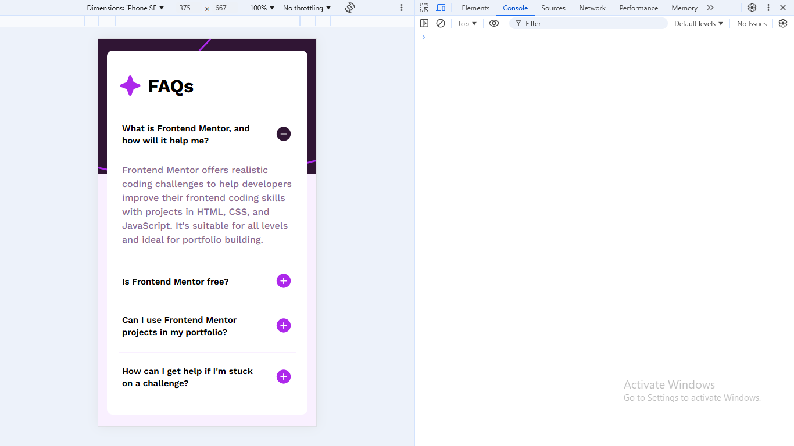
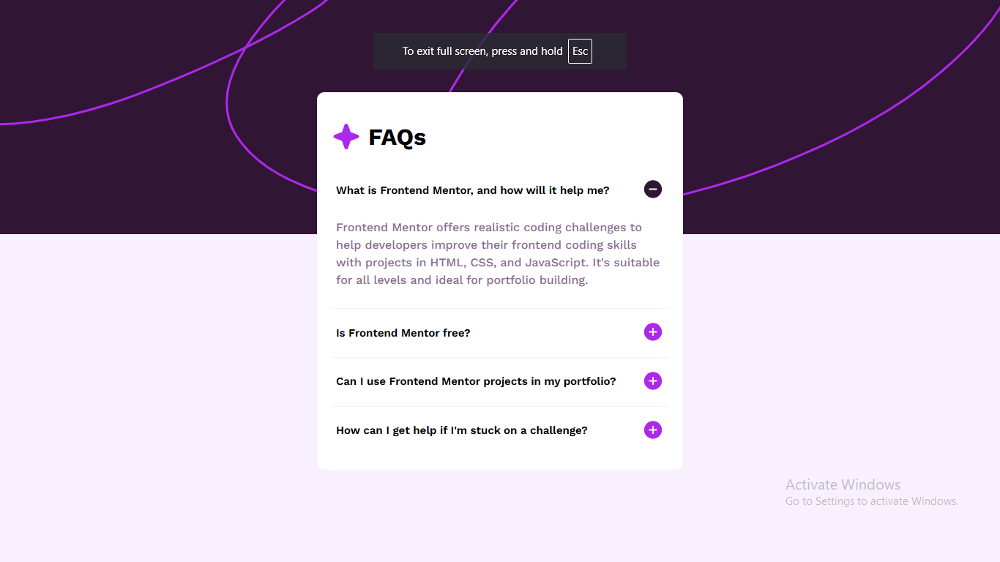

# Frontend Mentor - FAQ accordion solution

This is a solution to the [FAQ accordion challenge on Frontend Mentor](https://www.frontendmentor.io/challenges/faq-accordion-wyfFdeBwBz). Frontend Mentor challenges help me to improve my coding skills by building realistic projects. 

## Table of contents

- [Overview](#overview)
  - [The challenge](#the-challenge)
  - [Screenshot](#screenshot)
  - [Links](#links)
- [My process](#my-process)
  - [Built with](#built-with)
  - [What I learned](#what-i-learned)
  - [Continued development](#continued-development)
  - [Useful resources](#useful-resources)
- [Author](#author)

## Overview

### The challenge

Users should be able to:

- Hide/Show the answer to a question when the question is clicked
- Navigate the questions and hide/show answers using keyboard navigation alone(tab and enter buttons)
- View the optimal layout for the interface depending on their device's screen size
- See hover and focus-visible states for all interactive elements on the page

### Screenshot

### Links

- Solution URL: [frontendmentor solution link](https://www.frontendmentor.io/challenges/faq-accordion-wyfFdeBwBz/hub)
- Live Site URL: [Live link](https://saxabani.github.io/faq-accordion-main/)

## My process

### Built with

- CSS custom properties
- Flexbox
- Vanilla JS

### What I learned

I learned i can put events inside a loop 

### Continued development

Next time i want to update this project with frameworks and add new features in it

### Useful resources

- [stackoverflow](https://stackoverflow.com/questions/17981437/how-to-add-event-listeners-to-an-array-of-objects) - This helped me for putting events inside for loop

## Author

- Frontend Mentor - [ElomriOussama](https://www.frontendmentor.io/profile/saxabani)
